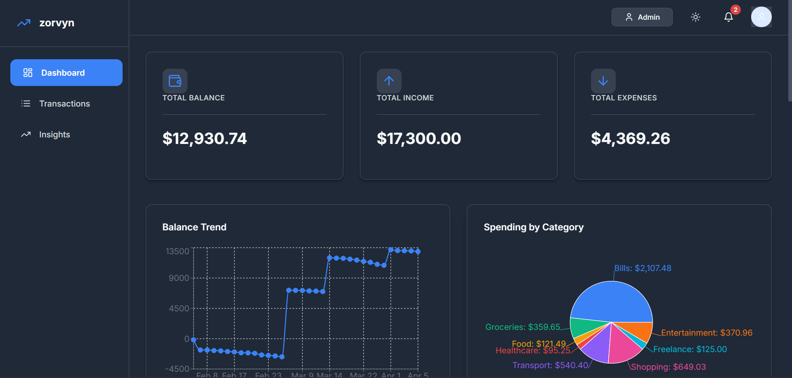
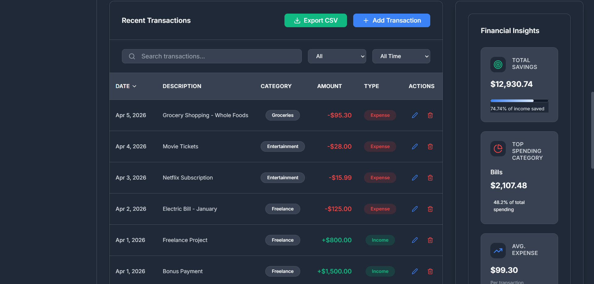
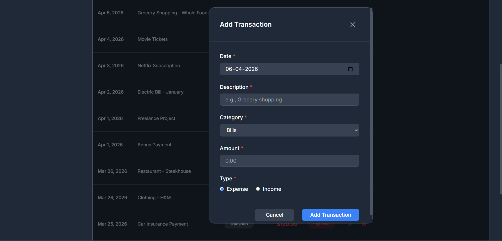
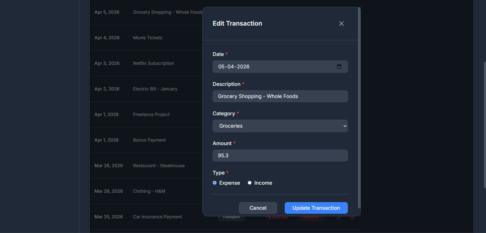
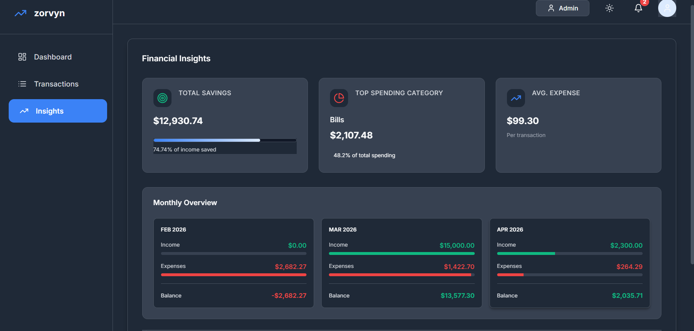

# Finance Dashboard

*A responsive web application for managing and visualizing personal finance data*

## Overview

The Finance Dashboard is a modern, responsive web application built with React that helps users track, manage, and analyze their personal finances. It provides an intuitive interface to monitor income, expenses, and financial insights through interactive charts and detailed transaction management.

## Features

- **Transaction Management**: Add, edit, and delete transactions with unique ID generation
- **Role-Based Access**: Admin and Viewer roles with different permissions
- **Responsive Design**: Optimized for mobile, tablet, and desktop devices
- **Search & Filtering**: Real-time search and filtering of transactions by category and date
- **Interactive Charts**: Time-based and category-based analytics with visual representations
- **Data Export**: Export transaction data as CSV files
- **Dark Mode**: Toggle between light and dark themes
- **Smooth Animations**: Professional UI transitions and hover effects
- **Data Persistence**: Local storage for data retention across sessions
- **Delete Confirmation**: Safety prompts before deleting transactions

## Tech Stack

- **React**: Frontend framework for building the user interface
- **JavaScript**: Programming language for application logic
- **CSS**: Styling with custom properties and responsive design
- **Context API**: State management for global application state
- **Recharts**: Chart library for data visualization

## Folder Structure

```
src/
├── components/     # Reusable UI components
├── context/        # React Context for state management
├── styles/         # CSS files and styling
├── utils/          # Helper functions and calculations
└── data/           # Mock data and constants
```

## Setup Instructions

1. **Clone the repository**
   ```bash
   git clone <repository-url>
   cd finance-dashboard
   ```

2. **Install dependencies**
   ```bash
   npm install
   ```

3. **Start the development server**
   ```bash
   npm start
   ```

4. **Open in browser**
   - Navigate to `http://localhost:3000`

**Requirements**: Node.js (version 14 or higher)

### Additional Dependencies

The project uses the following external libraries:

- **Recharts** – For data visualization charts  
- **Lucide React** – For modern icons  
- **UUID** – For generating unique transaction IDs  

These dependencies will be installed automatically when running:

npm install

If needed manually:

npm install recharts lucide-react uuid

## Approach & Design Decisions

- **Context API**: Used for centralized state management to handle transactions, filters, and user roles across components
- **Component-Based Architecture**: Modular design with reusable components for maintainability and scalability
- **Responsive Design**: Implemented using CSS media queries and flexible layouts to ensure compatibility across devices
- **Data Persistence**: Utilizes localStorage to maintain user data between sessions without requiring a backend
- **User Experience**: Focus on intuitive navigation, smooth animations, and accessibility features

## Future Improvements

- User authentication and account management
- Backend integration with database storage
- Multi-user support with data synchronization
- Advanced analytics and financial reporting
- Budget planning and goal tracking features
- Mobile app development using React Native


---

## 📸 Screenshots

### 📊 Dashboard Overview


---

### 📄 Transactions Page


---

### ➕ Add Transaction


---

### ✏️ Edit Transaction


---

### 📈 Insights & Analytics


---

## Author

**Vaishnavi Annasaheb Garad**  
Frontend Developer / Engineering Student

---

*Built with React and modern web technologies*
